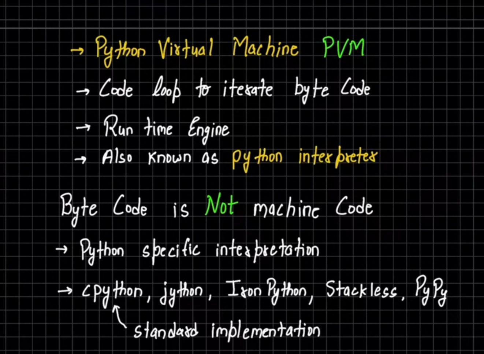

## Python (Core)
- Python 3 is the third major version of the Python programming language. It is an interpreted, high-level, general-purpose language widely used for web development, automation, data science, and more.

- in python how the code runs and behaves is controlled by a single community(python.org)
(unlike in languages like js whose behaviour changes on browser or on node etc)

- Python3 interpreter (also called the Python shell) allows you to execute Python commands interactively.

- **Python**: A high-level, interpreted programming language. It is a language specification.  
- **CPython**: The default and most widely used implementation of Python, written in C. It compiles Python code to bytecode and executes it in a virtual machine.  

In short: **Python is the language, CPython is its most common implementation.** 🚀

### pip
- pip (short for Package Installer for Python) is a command-line tool used to install, upgrade, and manage Python packages from the Python Package Index (PyPI). It makes it easy to install third-party libraries like NumPy, Pandas, Flask, and Django.

### PyPi
- PyPI is an online repository of Python packages. It hosts thousands of libraries that can be installed using pip. 